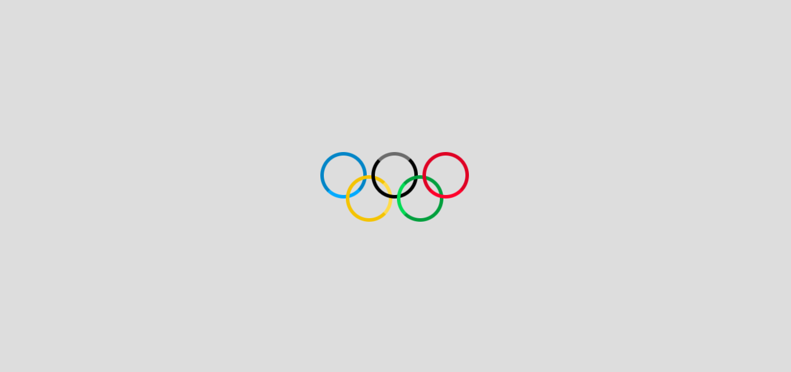

## LOADER ANNEAUX OLYMPIQUES

## Le challenge

Création d'un loader anneaux olympiques en HTML5 et CSS3.

## Démonstration

Lien vers le projet : https://aperbet56.github.io/loader_anneaux_olympiques/

## Projet développé avec

- Utilisation des balises sémantiques HTML5
- CSS3
- Flexbox
- Animations css (@keyframes)
- Page web responsive
- Desktop first
- Utilisation d'un normaliseur : le fichier normalize.css
- Commentaires HTML
- Commentaires CSS
